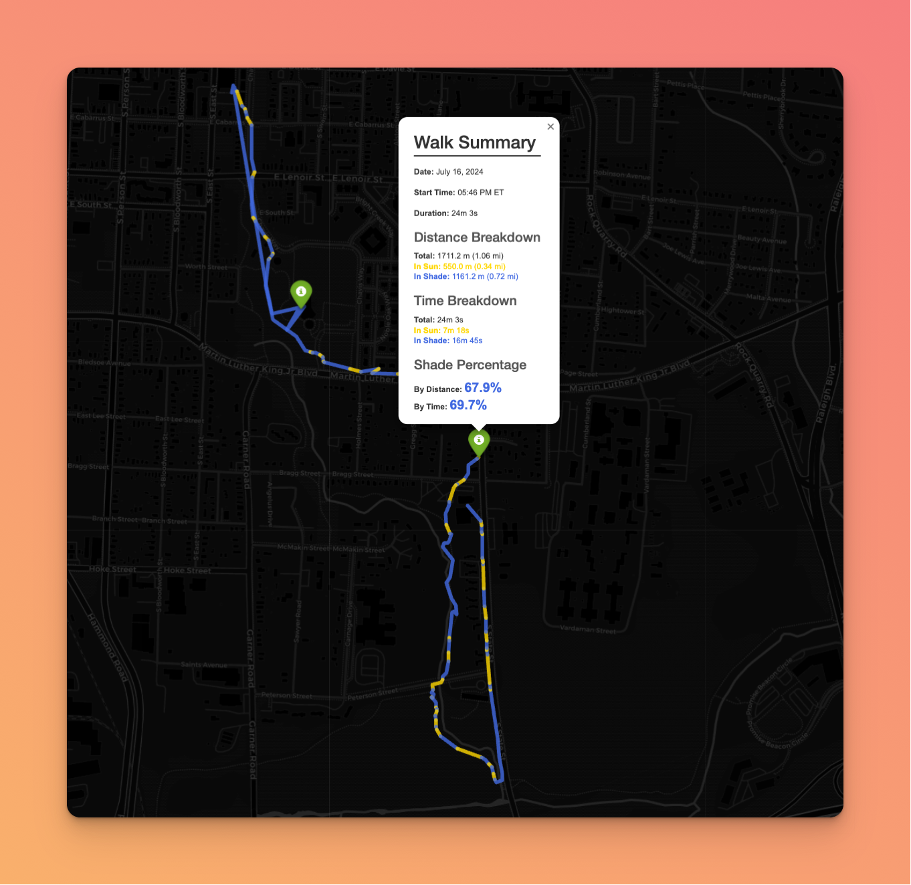

# Shady Walks

This project visualizes shade data from GPX files, creating an interactive map showing sunny and shady sections of walks.



## GitHub Pages

You can view the latest generated shade map at: https://wjhrdy.github.io/shady-walks/

The map is automatically updated daily and whenever changes are pushed to the main branch.

## Features

- Visualizes sunny and shady sections of walks
- Calculates shade percentage for each walk
- Shows duration of time spent in sun and shade
- Interactive map with popup information for each walk

## Setup and Installation

This project uses Poetry for dependency management and packaging. Follow these steps to set up your development environment:

1. First, make sure you have Poetry installed. If not, install it by following the instructions on the [official Poetry website](https://python-poetry.org/docs/#installation).

2. Clone this repository:
   ```
   git clone https://github.com/wjhrdy/shady-walks.git
   cd shady-walks
   ```

3. Install the project dependencies using Poetry:
   ```
   poetry install
   ```

4. Activate the virtual environment created by Poetry:
   ```
   poetry shell
   ```

Now you're ready to run the script and develop the project!

## Running the Script

Once you've set up your environment with Poetry, you can run the script like this:

1. Ensure you're in the project directory and your Poetry virtual environment is activated.

2. Place your GPX files in a directory named 'gpx' within the project directory.

3. Run the script:
   ```
   poetry run python shade_map_visualizer.py
   ```

4. Open the generated 'index.html' in a web browser to view your shade map.

## Capturing Shade Data with GPSLogger on Android

To capture the shade information for your walks, you can use the GPSLogger app on Android. Here's how to set it up and use it:

1. Download and install GPSLogger from the Google Play Store.

2. Open GPSLogger and go to the settings (three dots in the top right corner > Settings).

3. Under "Logging Details", ensure that:
   - "Log to GPX" is turned on
   - "Log to KML" and "Log to Plain Text" can be turned off

4. Under "Performance", set:
   - "Time before logging" to 0 seconds
   - "Distance filter" to 0 meters
   - This ensures that points are logged as soon as you tap the button

5. Under "Auto send, email and upload", set up your preferred method to get the GPX files off your phone (e.g., auto-email, Dropbox, etc.)

6. Before starting your walk, set up the annotation view:
   - Tap the three dots in the top right corner and select "Annotation markers"
   - Add two markers: one for "sun" and one for "shade"
   - This will create quick-access buttons for sun and shade annotations

7. To start logging your walk:
   - Tap the big green play button to start GPS logging
   - When you enter a shaded area, tap the "shade" marker in the annotation view
   - When you exit the shaded area, tap the "sun" marker
   - Continue this process throughout your walk
   - When finished, tap the big green button again to stop logging

8. Use your chosen method to get the GPX file off your phone and onto your computer

9. Place the GPX file in the 'gpx' directory of this project

Tips for better data collection:
- Try to annotate as soon as you enter or exit a shaded area for the most accurate results.
- If you forget to annotate a transition, you can add a waypoint at your current location with the correct annotation (sun or shade) as soon as you remember.
- For best results, try to walk at a consistent pace, especially when transitioning between sun and shade.
- The annotation view makes it much quicker and easier to log transitions - use it to your advantage!

Remember: The more consistently you log the transitions between sun and shade, the more accurate your shade map will be!

## Contributing

Contributions are welcome! Please feel free to submit a Pull Request.

1. Fork the repository
2. Create your feature branch (`git checkout -b feature/AmazingFeature`)
3. Commit your changes (`git commit -m 'Add some AmazingFeature'`)
4. Push to the branch (`git push origin feature/AmazingFeature`)
5. Open a Pull Request

Please ensure you have updated tests as appropriate and your code follows the project's coding style.

## License

[MIT License](LICENSE)